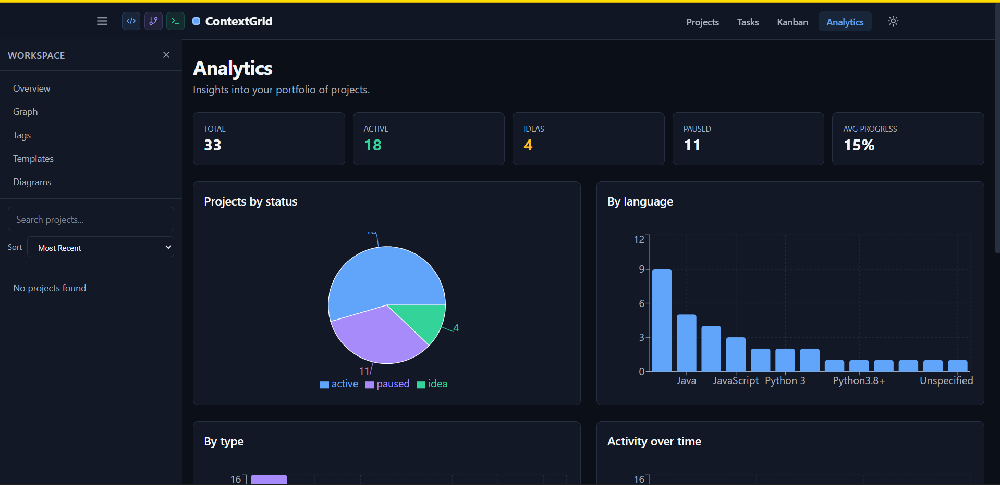

# ContextGrid



ContextGrid is a personal, local-first application for tracking coding projects across time, tools, and mental states.

It exists to answer a few simple questions clearly:

- What am I building?
- Where does it live?
- What state is it really in?
- What’s the next honest step?

Not a task manager.  
Not a SaaS clone.  
A thinking tool.

---

## Goals

- Track projects across languages, machines, and environments
- Emphasize **status and momentum**, not just completion
- Preserve context: notes, blockers, reflections
- Stay simple, local, and hackable

ContextGrid is designed for one user: me.

---

## Core Features

- ✅ Project metadata (name, type, language, stack, location)
- ✅ Clear lifecycle status (idea → active → paused → archived)
- ✅ Timestamped notes and reflections
- ✅ Tag-based organization and filtering
- ✅ REST API for programmatic access
- ✅ MySQL/MariaDB-backed, production-ready storage
- ✅ Command-line interface
- ✅ Web-based interface (legacy Jinja SSR in `web/` and a new React SPA in `frontend/`)
- ✅ Cross-device access via API

### React SPA frontend (experimental)

A new React + Vite + TypeScript SPA lives in `frontend/` and runs on the
`feature/react-frontend` branch. It consumes the existing FastAPI REST API and
adds full editing (drag-and-drop Kanban, optimistic mutations, in-place forms,
relationship graph via React Flow, charts via Recharts).

```bash
# Dev (two terminals):
uv run uvicorn api.server:app --host 0.0.0.0 --port 8003   # backend
cd frontend && npm install && npm run dev                  # frontend on :5173
# Vite proxies /api/* → http://localhost:8003

# Production (single server):
bash scripts/build_frontend.sh                             # builds frontend/dist
uv run uvicorn api.server:app --host 0.0.0.0 --port 8003
# → http://localhost:8003 serves both the SPA and the API
```

The legacy Jinja UI (`web/app.py`, port 8081) is preserved unchanged so the
two can run side-by-side during evaluation.

Simple to use, powerful to extend.

No accounts required.  
No cloud dependency.  
Your data, your control.

---

## Architecture

ContextGrid supports **flexible deployment modes** to fit your needs:

### Deployment Modes

```
Mode 1: Direct CLI (Local, No API Server)
┌─────────────┐
│     CLI     │────────▶  MySQL/MariaDB Database
└─────────────┘

Mode 2: API + CLI (Production/Multi-device)
┌─────────────┐         ┌─────────────┐
│     CLI     │────────▶│             │
└─────────────┘         │  API Server │         ┌──────────────┐
                        │   (FastAPI) │────────▶│ MySQL/MariaDB│
┌─────────────┐         │             │         │   Database   │
│   Web UI    │────────▶│             │         └──────────────┘
└─────────────┘         └─────────────┘
```

**Components:**
- **CLI** (`src/main.py`, `src/cli.py`): Command-line interface with dual mode support
  - **API mode**: Makes HTTP requests to API server
  - **Direct mode**: Connects directly to database
- **Web UI** (`web/app.py`): Web-based interface (requires API server)
- **API Server** (`api/server.py`): FastAPI REST API handling all business logic
- **Database**: MySQL/MariaDB backend behind a unified `DatabaseBackend` interface

### Benefits

- **Simplicity**: Direct mode needs no API server for personal use
- **Cross-device access**: API mode enables access from any machine
- **Scalability**: API server can handle multiple clients simultaneously
- **Separation of concerns**: Clean separation between UI, business logic, and data storage
- **Future-proof**: Easy to add mobile apps, integrations, or new clients

---

## Configuration

ContextGrid uses environment variables for configuration. Create a `.env` file or set environment variables directly.

### Quick Configuration Examples

**Example 1: Direct CLI (No API Server)**
```bash
# .env
USE_API=false
MYSQL_HOST=localhost
MYSQL_PORT=3306
MYSQL_USER=contextgrid_user
MYSQL_PASSWORD=your_password
MYSQL_DATABASE=contextgrid
```

**Example 2: API + CLI (Production)**
```bash
# .env
USE_API=true
API_URL=http://localhost:8003

# API Server config (in separate terminal)
DB_HOST=localhost
DB_PORT=3306
DB_NAME=contextgrid
DB_USER=contextgrid_user
DB_PASSWORD=your_password
```

### Configuration Variables

**CLI Mode:**
- `USE_API`: `true` or `false` (default: `true`)
  - `true`: CLI uses API server (requires API server running)
  - `false`: CLI connects directly to database
- `API_URL`: API server URL (default: `http://localhost:8003`)

**MySQL/MariaDB Configuration (Direct mode):**
- `MYSQL_HOST`: MySQL/MariaDB hostname (default: `localhost`)
- `MYSQL_PORT`: MySQL/MariaDB port (default: `3306`)
- `MYSQL_USER`: MySQL/MariaDB username (required)
- `MYSQL_PASSWORD`: MySQL/MariaDB password (required)
- `MYSQL_DATABASE`: MySQL/MariaDB database name (default: `contextgrid`)

**API Server Configuration:**
- `API_HOST`: API server bind address (default: `0.0.0.0`)
- `API_PORT`: API server port (default: `8003`)
- `DB_HOST`, `DB_PORT`, `DB_NAME`, `DB_USER`, `DB_PASSWORD`: MySQL/MariaDB settings for API server

See `.env.example` for a complete configuration template.

---

## Tech Stack

- **Language:** Python 3.8+
- **Database:** MySQL 8.0+ or MariaDB (unified interface via `pymysql`)
- **API Framework:** FastAPI
- **Web Server:** Uvicorn
- **Database Driver:** PyMySQL
- **CLI:** Pure Python with argparse

---

## Project Structure

```text
contextgrid/
├── README.md
├── API.md                        # API documentation
├── PYTHON_APP_RUN_MODES.md       # Guide to Python UI/backend app shapes
├── .env.example                  # Example environment variables
├── requirements.txt              # Python dependencies
├── api/
│   ├── __init__.py
│   ├── server.py                 # FastAPI application
│   ├── db.py                     # MySQL database layer (for API)
│   ├── models.py                 # Pydantic models
│   └── config.py                 # API server configuration
├── src/
│   ├── main.py                   # CLI entry point
│   ├── cli.py                    # CLI commands
│   ├── config.py                 # CLI configuration (dual mode support)
│   ├── api_client.py             # HTTP client for API mode
│   ├── models.py                 # Model wrappers (works in both modes)
│   └── db.py                     # Database abstraction layer (MySQL/MariaDB)
├── web/
│   ├── app.py                    # Web UI
│   ├── static/                   # CSS, JS, images
│   └── templates/                # Jinja2 templates
└── scripts/
    └── init_mysql.sql            # MySQL/MariaDB schema
```

---

## Quick Start

First, install dependencies:

```bash
uv sync
```

Then choose your deployment mode based on your needs:

### Option 1: Direct CLI (No API Server)

Connects straight to a MySQL/MariaDB database — no API server required.

#### Prerequisites

1. **Python 3.8+**
   ```bash
   python3 --version  # should be 3.8 or higher
   ```

2. **MySQL 8.0+ or MariaDB**
   ```bash
   mysql --version
   ```

#### Setup

1. **Set Up the Database**

   Create a database and user:

   ```sql
   CREATE DATABASE contextgrid;
   CREATE USER 'contextgrid_user'@'localhost' IDENTIFIED BY 'your_secure_password';
   GRANT ALL PRIVILEGES ON contextgrid.* TO 'contextgrid_user'@'localhost';
   FLUSH PRIVILEGES;
   ```

2. **Configure Environment**

   ```bash
   cp .env.example .env
   ```

   Edit `.env` and set:

   ```bash
   USE_API=false
   MYSQL_HOST=localhost
   MYSQL_PORT=3306
   MYSQL_USER=contextgrid_user
   MYSQL_PASSWORD=your_secure_password
   MYSQL_DATABASE=contextgrid
   ```

3. **Start using immediately:**
   ```bash
   uv run python src/main.py add "My First Project"
   uv run python src/main.py list
   ```

#### Running the CLI
```bash
uv run python src/main.py add "My First Project"
uv run python src/main.py list
uv run python src/main.py show 1
```

### Option 1b: With Web UI (Direct + API + Web)

Same as Option 1, but with a browser interface.

**Terminal 1 - API Server:**
```bash
uv run uvicorn api.server:app --host 0.0.0.0 --port 8003 --reload
```

**Terminal 2 - Web UI:**
```bash
uv run uvicorn web.app:app --port 8001 --reload
```

Then open `http://localhost:8001` in your browser.

**Configure with `.env`:**
```bash
USE_API=true
API_URL=http://localhost:8003
API_ENDPOINT=http://localhost:8003
DB_HOST=localhost
DB_PORT=3306
DB_NAME=contextgrid
DB_USER=contextgrid_user
DB_PASSWORD=your_secure_password
```

### Option 2: MySQL/MariaDB + API + CLI (Production/Multi-device Setup)

Use the API server for cross-device access.

#### Prerequisites

1. **Python 3.8+**
   ```bash
   python3 --version  # should be 3.8 or higher
   ```

2. **MySQL 8.0+ or MariaDB**
   ```bash
   mysql --version
   ```

#### Setup

1. **Create Virtual Environment**

   ```bash
   python3 -m venv venv
   source venv/bin/activate  # On Linux/Mac
   # or
   venv\Scripts\activate     # On Windows
   ```

2. **Install Dependencies**

   ```bash
   pip install -r requirements.txt
   ```

3. **Set Up the Database**

   Create a database and user:

   ```sql
   CREATE DATABASE contextgrid;
   CREATE USER 'contextgrid_user'@'localhost' IDENTIFIED BY 'your_secure_password';
   GRANT ALL PRIVILEGES ON contextgrid.* TO 'contextgrid_user'@'localhost';
   FLUSH PRIVILEGES;
   ```

4. **Configure Environment**

   Copy the example environment file and update with your settings:

   ```bash
   cp .env.example .env
   ```

   Edit `.env` and set your configuration:

   ```bash
   # CLI Configuration
   USE_API=true
   API_URL=http://localhost:8003
   
   # API Server Configuration
   DB_HOST=localhost
   DB_PORT=3306
   DB_NAME=contextgrid
   DB_USER=contextgrid_user
   DB_PASSWORD=your_secure_password
   
   API_HOST=0.0.0.0
   API_PORT=8003
   ```

5. **Initialize Database**

   The API server automatically creates tables on first run. Just start the server:

   ```bash
   python api/server.py
   ```

   Alternatively, you can manually run the schema:

   ```bash
   mysql -u contextgrid_user -p contextgrid < scripts/init_mysql.sql
   ```

---

## Running ContextGrid

### Mode 1: Direct CLI (No API Server)

```bash
USE_API=false python src/main.py list
```

Or configure in `.env`:
```bash
USE_API=false
MYSQL_HOST=localhost
MYSQL_USER=contextgrid_user
MYSQL_PASSWORD=your_password
```

Then use normally:
```bash
python src/main.py add "My Project"
python src/main.py list
python src/main.py show 1
```

### Mode 2: API + CLI

#### Start the API Server

```bash
# Run as a module
python -m api.server
```

The API will be available at `http://localhost:8003`.
API documentation is available at `http://localhost:8003/docs`.

#### Using the CLI

With the API server running, use the CLI:

```bash
# If USE_API=true in .env (default)
python src/main.py add "My Project"
python src/main.py list
python src/main.py show 1
```

All CLI commands communicate with the API server.

#### Start the Web UI (Optional)

In a separate terminal:

```bash
python web/app.py
```

The web interface will be available at `http://localhost:8080`.

---

## API Server

The API server provides a REST API for all project management operations.

### Endpoints

See [API.md](API.md) for complete API documentation.

**Key Endpoints:**
- `GET /api/health` - Health check
- `GET /api/projects` - List projects
- `POST /api/projects` - Create project
- `PUT /api/projects/{id}` - Update project
- `DELETE /api/projects/{id}` - Delete project
- `POST /api/projects/{id}/touch` - Update last worked timestamp
- `GET /api/tags` - List tags
- `POST /api/projects/{id}/tags` - Add tag
- `GET /api/projects/{id}/notes` - List notes
- `POST /api/projects/{id}/notes` - Add note

### Configuration

Configure the API server via environment variables in `.env`:

- `API_HOST`: API server host (default: `0.0.0.0`)
- `API_PORT`: API server port (default: `8003`)
- `DB_HOST`: MySQL host (default: `localhost`)
- `DB_PORT`: MySQL port (default: `3306`)
- `DB_NAME`: MySQL database name
- `DB_USER`: MySQL username
- `DB_PASSWORD`: MySQL password

---

## CLI Usage

### Using the CLI

**Create your first project:**

```bash
python src/main.py add "ContextGrid"
# Follow the interactive prompts to add details
```

**List all projects:**

```bash
python src/main.py list
```

**Filter by status:**

```bash
python src/main.py list --status active
```

**View project details:**

```bash
python src/main.py show 1
```

**Update a project:**

```bash
python src/main.py update 1
# Follow prompts to change any field
```

**Touch timestamp (mark as recently worked on):**

```bash
python src/main.py touch 1
```

**Add tags to organize projects:**

```bash
# Add a tag to a project
python src/main.py tag add 1 python

# Add multiple tags
python src/main.py tag add 1 web
python src/main.py tag add 1 backend

# List all tags
python src/main.py tag list

# List tags for a specific project
python src/main.py tag list 1

# Remove a tag
python src/main.py tag remove 1 python

# Filter projects by tag
python src/main.py list --tag python

# Combine filters
python src/main.py list --status active --tag web
```

**Generate a visual roadmap:**

```bash
python src/main.py roadmap
# Creates ROADMAP.md with all projects organized by status

# Custom output location:
python src/main.py roadmap --output docs/MY_ROADMAP.md
```

### Example Session

```bash
# Add a new project
$ python src/main.py add "Personal Dashboard"

Creating project: Personal Dashboard
==================================================
Description (optional): Web app to track my projects
Status [idea]: active
Type (optional): web
Primary language (optional): Python
Stack/tech (optional): FastAPI + MySQL
...

[OK] Project created with ID: 1

# List projects
$ python src/main.py list

All Projects:
================================================================================

[1] Personal Dashboard
    Status: active | Type: web | Language: Python
    Web app to track my projects
    Created: 2024-12-24T10:30:00.000000

# Touch it after working
$ python src/main.py touch 1
[OK] Updated last_worked_at for project 1

# Generate roadmap visualization
$ python src/main.py roadmap
[OK] Roadmap generated: D:\Code\Python\PythonApps\contextgrid\ROADMAP.md
     Projects: 1
     Active: 1, Ideas: 0
```

---

## Web UI

ContextGrid includes a beautiful web interface for browsing and managing your projects.

### Starting the Web UI

```bash
# Make sure the API server is running first!
python api/server.py

# Then in another terminal, start the web UI
python web/app.py
```

The web interface will be available at: **http://127.0.0.1:8080**

**Note:** The Web UI requires the API server to be running on `http://localhost:8003`.

### Features

- 📊 **Dashboard** - Quick stats and recent activity
- 📁 **Projects List** - Browse all projects with filters
- 🏷️ **Tags** - Organize and filter by tags
- 📝 **Project Details** - View full project information and notes
- 📱 **Responsive** - Works great on mobile devices
- 🎨 **Modern Design** - Clean, beautiful interface

The web UI is **read-focused** - for creating/editing projects, use the CLI commands. This keeps the web interface simple and the CLI powerful.

---

## Tag Management

Tags help you organize and filter projects by categories, technologies, or any custom labels.

### Adding Tags

```bash
# Add a tag to a project
python src/main.py tag add <project_id> <tag_name>

# Example: tag project 1 with "python" and "web"
python src/main.py tag add 1 python
python src/main.py tag add 1 web
```

### Viewing Tags

```bash
# List all tags with project counts
python src/main.py tag list

# Output:
# All Tags:
# ================================================================================
#   • python (3 projects)
#   • web (2 projects)
#   • cli (1 project)

# List tags for a specific project
python src/main.py tag list 1

# Output:
# Tags for project: ContextGrid
# ================================================================================
#   • python
#   • cli
```

### Filtering by Tags

```bash
# Show all projects with a specific tag
python src/main.py list --tag python

# Combine with status filter
python src/main.py list --status active --tag web
```

### Removing Tags

```bash
# Remove a tag from a project
python src/main.py tag remove <project_id> <tag_name>

# Example:
python src/main.py tag remove 1 web
```

---

## Roadmap Visualization

ContextGrid can generate a beautiful `ROADMAP.md` file that visualizes all your projects:

- **Organized by status** (Active → Ideas → Paused → Archived)
- **Rich metadata tables** with all project details
- **Timeline information** showing when projects were created/worked on
- **Summary statistics** showing project counts by status
- **Emoji indicators** for quick visual scanning

The roadmap is perfect for:

- Getting a bird's-eye view of all your work
- Sharing your project portfolio
- Tracking progress over time
- Making decisions about what to focus on next

---

## Future Plans

- Enhanced full-text search across projects and notes via API
- Timeline view of project activity
- Authentication and multi-user support
- Export/import functionality for backups
- Mobile app
- Desktop app (Electron or Tauri)
- Integration with Git for auto-tracking
- Webhooks for external integrations

---

## Building Executables

You can bundle ContextGrid into standalone executables using PyInstaller. This ensures you do not need to rely on the `uv` environment or a python runtime to run the CLI, Web Server, or API. 

### Building

To generate the binaries, simply run the orchestration script from the project root:

```bash
uv run python build.py
```

This will run PyInstaller sequentially to build the three main applications and collect them into the `dist/` directory:

1. `dist/cg/cg.exe` — The fast direct CLI (no python required).
2. `dist/contextgrid-api/contextgrid-api.exe` — The standalone FastAPI web server.
3. `dist/contextgrid-web/contextgrid-web.exe` — The standalone Jinja UI front-end.

To use the standalone CLI, add `contextgrid/dist/cg` to your `PATH` variable, and you can run it anywhere directly using `cg list`.

---

## Troubleshooting

### Configuration Issues

**Problem:** Not sure which mode to use

**Solution:**
- **Direct**: No API server needed, connects straight to MySQL/MariaDB
- **API**: Production setup with cross-device access

Check your current configuration:
```bash
python src/main.py --help  # Will show mode info
```

### API Server Won't Start

**Problem:** `Database connection failed` error

**Solution:**
1. Check that MySQL is running: `systemctl status mysql` (Linux) or `brew services list` (Mac)
2. Verify database credentials in `.env` file (DB_HOST, DB_USER, DB_PASSWORD)
3. Ensure database exists: `mysql -u root -p -e "SHOW DATABASES;"`
4. Test connection: `mysql -u contextgrid_user -p contextgrid`

### CLI Commands Fail (API Mode)

**Problem:** `Cannot connect to API server` error when `USE_API=true`

**Solution:**
1. Ensure API server is running: `python api/server.py`
2. Check `API_URL` in `.env` matches the server address
3. Verify API server is listening: `curl http://localhost:8003/api/health`
4. Or switch to direct mode: Set `USE_API=false` in `.env`

### CLI Commands Fail (Direct Mode)

**Problem:** Database errors when `USE_API=false`

**Solution:**
1. Verify MySQL/MariaDB is running
2. Check `MYSQL_*` credentials in `.env`
3. Test connection: `mysql -u $MYSQL_USER -p $MYSQL_DATABASE`

### MySQL Permission Errors

**Problem:** Access denied for user

**Solution:**
```sql
-- Grant proper permissions
GRANT ALL PRIVILEGES ON contextgrid.* TO 'contextgrid_user'@'localhost';
FLUSH PRIVILEGES;
```

### Web UI Shows Empty Data

**Problem:** Web UI loads but shows no projects

**Solution:**
1. Verify API server is running on the expected port (8003)
2. Check browser console for errors (F12)
3. Ensure Web UI is configured to connect to the correct API endpoint
4. Note: Web UI requires API server (doesn't support direct database access)

### Port Conflicts

**Problem:** `Address already in use` error

**Solution:**
1. API server uses port 8003, Web UI uses port 8080
2. Change ports in `.env` or when starting servers
3. Kill existing processes: `lsof -i :8003` and `kill <PID>`

### Switching Modes

**Problem:** Want to switch from API mode to direct mode (or vice versa)

**Solution:**

**To switch from API to Direct:**
```bash
# Edit .env
USE_API=false
MYSQL_HOST=localhost
MYSQL_USER=contextgrid_user
MYSQL_PASSWORD=your_password

# Now CLI connects directly to database
python src/main.py list
```

**To switch from Direct to API:**
```bash
# Edit .env
USE_API=true
API_URL=http://localhost:8003

# Start API server in another terminal
python api/server.py

# Now CLI uses API
python src/main.py list
```

---

## Development

### Running Tests

```bash
# TODO: Add tests
pytest
```

### Code Style

This project uses:
- PEP 8 for Python code style
- Type hints where appropriate
- Docstrings for all public functions

### Contributing

This is a personal project, but suggestions and feedback are welcome!

---

## License

[License information here]

---

## Acknowledgments

Built with:
- [FastAPI](https://fastapi.tiangolo.com/) - Modern Python web framework
- [PyMySQL](https://github.com/PyMySQL/PyMySQL) - Pure Python MySQL client
- [Pydantic](https://pydantic-docs.helpmanual.io/) - Data validation
- [Uvicorn](https://www.uvicorn.org/) - ASGI server

---

*ContextGrid - Track what you're building, where it lives, and what's next.*
