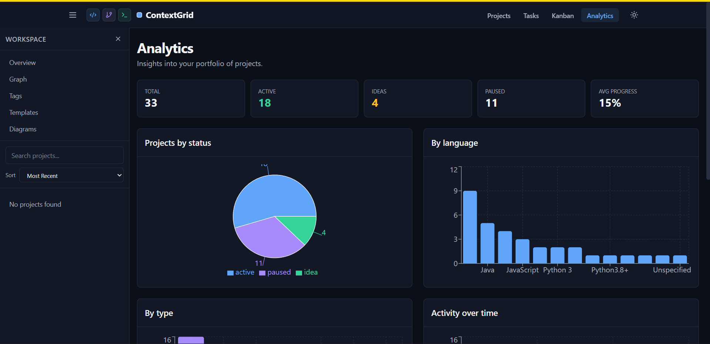

# ContextGrid



ContextGrid is a personal, local-first application for tracking coding projects across time, tools, and mental states.

It exists to answer a few simple questions clearly:

- What am I building?
- Where does it live?
- What state is it really in?
- What’s the next honest step?

Not a task manager.  
Not a SaaS clone.  
A thinking tool.

No accounts required. No cloud dependency. Your data, your control.

---

## Features

- Project metadata (name, type, language, stack, location)
- Clear lifecycle status (idea → active → paused → archived)
- Timestamped notes and reflections
- Tag-based organization and filtering
- REST API (FastAPI) for programmatic and cross-device access
- MySQL/MariaDB storage
- Command-line interface
- Two web frontends:
  - **React SPA** (`frontend/`) — full editing, drag-and-drop Kanban, optimistic updates, relationship graph (React Flow), charts (Recharts)
  - **Legacy Jinja2 UI** (`web/`) — read-focused; edits go through the CLI
- Markdown roadmap generation

---

## Architecture

```
Direct mode (USE_API=false)
┌─────────────┐
│     CLI     │────────▶  MySQL/MariaDB
└─────────────┘

API mode (USE_API=true, default)
┌─────────────┐         ┌─────────────┐
│     CLI     │────────▶│             │
├─────────────┤         │  API Server │         ┌──────────────┐
│  React SPA  │────────▶│  (FastAPI)  │────────▶│ MySQL/MariaDB│
├─────────────┤         │             │         └──────────────┘
│  Jinja2 UI  │────────▶│             │
└─────────────┘         └─────────────┘
```

- **CLI** (`src/main.py`, `src/cli.py`) — talks to the API over HTTP, or directly to the database in direct mode
- **API Server** (`api/server.py`) — FastAPI REST API; also serves the built React SPA in production
- **React SPA** (`frontend/`) — Vite + TypeScript + Tailwind + TanStack Query
- **Jinja2 UI** (`web/app.py`) — requires the API server
- **Database** — MySQL/MariaDB behind a `DatabaseBackend` interface (`src/db.py`)

Direct mode needs no API server; API mode enables cross-device access and the web frontends.

---

## Quick Start

### Prerequisites

- [uv](https://docs.astral.sh/uv/) (manages Python 3.8+ and dependencies)
- MySQL 8.0+ or MariaDB
- Node.js + npm (only for the React SPA)

### 1. Install dependencies

```bash
uv sync
```

### 2. Create the database

```sql
CREATE DATABASE contextgrid;
CREATE USER 'contextgrid_user'@'localhost' IDENTIFIED BY 'your_secure_password';
GRANT ALL PRIVILEGES ON contextgrid.* TO 'contextgrid_user'@'localhost';
FLUSH PRIVILEGES;
```

The API server creates tables on first run. To load the schema manually instead:

```bash
mysql -u contextgrid_user -p contextgrid < scripts/init_mysql.sql
```

### 3. Configure

```bash
cp .env.example .env
```

Edit `.env` with your database credentials (see [Configuration](#configuration)).

### 4. Run

**API server** (required for API mode and both web UIs):

```bash
uv run uvicorn api.server:app --host 0.0.0.0 --port 8003
# or: bash start.sh (Linux/Mac) / start.bat (Windows)
```

Interactive API docs: `http://localhost:8003/docs`

**React SPA — development** (separate terminal; Vite proxies `/api/*` to `:8003`):

```bash
cd frontend && npm install && npm run dev   # http://localhost:5173
```

**React SPA — production** (served by the API server at `http://localhost:8003`):

```bash
bash scripts/build_frontend.sh
uv run uvicorn api.server:app --host 0.0.0.0 --port 8003
```

**Legacy Jinja2 UI** (separate terminal):

```bash
uv run python web/app.py   # http://localhost:8081
```

**CLI:**

```bash
uv run python src/main.py list
```

---

## Configuration

All configuration is via environment variables, typically in `.env`. See `.env.example` for the full template.

| Variable | Purpose | Default |
| -------- | ------- | ------- |
| `USE_API` | `true`: CLI uses the API server. `false`: CLI connects directly to the DB | `true` |
| `API_URL` | API server URL used by the CLI | `http://localhost:8003` |
| `API_ENDPOINT` | API server URL used by the Jinja2 UI | `http://localhost:8003` |
| `API_HOST` / `API_PORT` | API server bind address and port | `0.0.0.0` / `8003` |
| `DB_HOST` / `DB_PORT` | MySQL/MariaDB host and port | `localhost` / `3306` |
| `DB_NAME` | Database name | `contextgrid` |
| `DB_USER` / `DB_PASSWORD` | Database credentials | — (required) |
| `DB_POOL_SIZE` / `DB_MAX_OVERFLOW` | Connection pool | `5` / `10` |
| `ALLOWED_ORIGINS` | CORS allowlist (comma-separated) | localhost dev + prod ports |
| `MAX_UPLOAD_BYTES` | Max screenshot upload size | 10 MB |
| `MAX_README_BYTES` | Max README snapshot size | 1 MB |
| `SLOW_REQUEST_MS` | Threshold for slow-request WARN logs | `200` |

The same `DB_*` variables are used by both the API server and the CLI in direct mode. The older `MYSQL_HOST`, `MYSQL_PORT`, `MYSQL_USER`, `MYSQL_PASSWORD`, and `MYSQL_DATABASE` names are still accepted as aliases.

---

## CLI Usage

Commands below use `uv run python src/main.py`; `uv run python cg.py` is an equivalent shortcut.

```bash
# Projects
uv run python src/main.py add "My Project"        # interactive prompts for details
uv run python src/main.py list
uv run python src/main.py list --status active
uv run python src/main.py show 1
uv run python src/main.py update 1                 # interactive prompts
uv run python src/main.py touch 1                  # mark as recently worked on

# Tags
uv run python src/main.py tag add 1 python
uv run python src/main.py tag list                 # all tags with project counts
uv run python src/main.py tag list 1               # tags for project 1
uv run python src/main.py tag remove 1 python
uv run python src/main.py list --tag python
uv run python src/main.py list --status active --tag web

# Roadmap
uv run python src/main.py roadmap                  # writes ROADMAP.md
uv run python src/main.py roadmap --output docs/MY_ROADMAP.md
```

`roadmap` generates a Markdown overview of all projects grouped by status (Active → Ideas → Paused → Archived), with metadata tables, timeline info, and summary counts.

### Example Session

```bash
$ uv run python src/main.py add "Personal Dashboard"

Creating project: Personal Dashboard
==================================================
Description (optional): Web app to track my projects
Status [idea]: active
Type (optional): web
Primary language (optional): Python
Stack/tech (optional): FastAPI + MySQL
...

[OK] Project created with ID: 1

$ uv run python src/main.py list

All Projects:
================================================================================

[1] Personal Dashboard
    Status: active | Type: web | Language: Python
    Web app to track my projects
    Created: 2024-12-24T10:30:00.000000
```

---

## API

See [docs/API.md](docs/API.md) for complete documentation, or `http://localhost:8003/docs` when the server is running.

Key endpoints:

- `GET /api/health` — health check
- `GET /api/projects` / `POST /api/projects` — list / create projects
- `PUT /api/projects/{id}` / `DELETE /api/projects/{id}` — update / delete a project
- `POST /api/projects/{id}/touch` — update last-worked timestamp
- `GET /api/tags` / `POST /api/projects/{id}/tags` — list tags / add a tag
- `GET /api/projects/{id}/notes` / `POST /api/projects/{id}/notes` — list / add notes

---

## Project Structure

```text
contextgrid/
├── api/                  # FastAPI server, API-layer DB, Pydantic models, middleware
├── src/                  # CLI: entry point, commands, config, API client, DB backend
├── frontend/             # React SPA (Vite + TypeScript)
├── web/                  # Legacy Jinja2 UI (app, templates, static assets)
├── scripts/              # Schema, DB init/test helpers, frontend build script
├── tests/                # pytest suite
├── docs/                 # API docs and design notes
├── build.py              # PyInstaller build orchestration
├── cg.py                 # CLI shortcut
├── start.sh / start.bat  # Launch helpers
├── pyproject.toml        # Python dependencies (managed by uv)
└── .env.example          # Configuration template
```

---

## Development

### Tests

```bash
uv run pytest                     # Python suite (DB calls are mocked; no database needed)
uv run pytest tests/test_cli_parser.py
uv run pytest -v
cd frontend && npm run test       # Frontend unit tests (Vitest)
```

The Python suite covers CLI argument parsing, Pydantic model validation, API endpoint behaviour (CORS, upload limits, pagination), request-timing middleware, project-type consistency, README snapshot logic, and security (URL scheme validation, SVG rejection, file-size caps).

### Dependencies

```bash
uv add <package>          # runtime dependency
uv add --dev <package>    # dev dependency
```

### Building Executables

Bundle the CLI, API server, and Jinja2 UI into standalone executables with PyInstaller (no Python runtime needed to run them):

```bash
uv run python build.py
```

Output in `dist/`:

1. `dist/cg/cg.exe` — CLI
2. `dist/contextgrid-api/contextgrid-api.exe` — API server
3. `dist/contextgrid-web/contextgrid-web.exe` — Jinja2 UI

Add `dist/cg` to your `PATH` to run `cg list` from anywhere.

---

## Troubleshooting

**API server: `Database connection failed`**

1. Check MySQL/MariaDB is running (`systemctl status mysql` / `brew services list`)
2. Verify `DB_HOST`, `DB_USER`, `DB_PASSWORD` in `.env`
3. Test the connection: `mysql -u contextgrid_user -p contextgrid`

**CLI: `Cannot connect to API server` (API mode)**

1. Make sure the API server is running
2. Check `API_URL` in `.env`
3. `curl http://localhost:8003/api/health`
4. Or switch to direct mode with `USE_API=false`

**MySQL `Access denied for user`**
The grant must match the host the app connects from:

```sql
GRANT ALL PRIVILEGES ON contextgrid.* TO 'contextgrid_user'@'localhost';
FLUSH PRIVILEGES;
```

**Jinja2 UI shows no projects**
It requires the API server (no direct DB access). Check that `API_ENDPOINT` points at it and look for errors in the browser console.

**`Address already in use`**
Defaults: API `8003`, React dev server `5173`, Jinja2 UI `8081`. Find the process with `lsof -i :<port>`, or change `API_PORT` in `.env`.

**Which mode is active?**
`uv run python src/main.py --help` shows the current mode.

---

## Future Plans

- Full-text search across projects and notes
- Timeline view of project activity
- Authentication and multi-user support
- Export/import for backups
- Mobile and desktop apps
- Git integration for auto-tracking
- Webhooks for external integrations

---

## Acknowledgments

Built with [FastAPI](https://fastapi.tiangolo.com/), [PyMySQL](https://github.com/PyMySQL/PyMySQL), [Pydantic](https://docs.pydantic.dev/), [Uvicorn](https://www.uvicorn.org/), [React](https://react.dev/), and [Vite](https://vite.dev/).

---

*ContextGrid — Track what you're building, where it lives, and what's next.*
