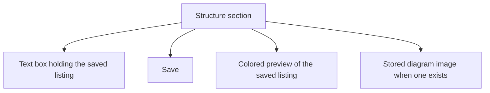

# Folder Structure on the Structure Tab - Plan

## Goal Capsule

- **Objective:** A person can add a project's folder tree from the Structure section and tell folders from files by color.
- **Means:** Paste a `tree` listing and color the saved text by kind.
- **Product authority:** This plan. A node editor, a diagram URL field, depth rails, explorer rows, and reading a tree from the project's local path are not active scope.
- **Open blockers:** None.

---

## Product Contract

### Summary

The Structure section of a project accepts a pasted `tree` listing, saves it, and shows a colored preview. Folder names are one color, file names another, and the tree marks stay quiet.

### Problem Frame

The Structure section already shows a saved listing, and when none is saved it tells the person to edit the project. The edit-project form has no place to enter a listing, so that instruction cannot be followed in the app they use. The listing and an optional diagram image are already stored on the project. The older server-rendered forms can edit both. This gap is the React project page.

### Key Decisions

- **Paste on the Structure section.** (session-settled: user-directed — chosen over a node-by-node editor and a new diagram URL field: the pasted listing stays the source.) Governs R1, R6.
- **Colored preview in the first version.** (session-settled: user-directed — chosen over a plain code block: the color is the point of the change.) Governs R3.
- **Kind coloring.** (session-settled: user-directed — chosen over depth rails and explorer rows: color marks folder versus file, and the pasted marks stay.) Governs R3.
- **Folder test.** (session-settled: user-approved — chosen over treating a trailing slash as the only signal: a normal `tree` paste has no slashes.) Governs R4.
- **Preview follows Save.** (session-settled: user-approved — chosen over recoloring while typing: the approved scope keeps the preview tied to the saved listing.) Governs R5.
- **Empty save clears.** (session-settled: user-approved — chosen over keeping the previous listing when the box is emptied: the approved scope clears on an empty save.) Governs R2.

### Requirements

**Capture**

- R1. On a project's Structure section, the person can paste a folder-tree listing into a text box and save it with an explicit Save. When no listing is saved, that box is the way to add one.
- R2. Saving replaces the project's stored listing, and an empty box clears it, within the existing length limit.

**Preview**

- R3. After a successful save, the section shows the saved listing with folder names in one color, file names in another, and the tree marks quiet. The two name colors stay distinguishable in every theme the app already ships.
- R4. A line is a folder when a deeper line is nested under it or when its name ends in `/`, and every other line, including an empty folder with no slash, is a file.
- R5. The text box shows the saved listing so the person can replace it. The colored preview updates only after Save, per R3.

**Already stored image**

- R6. A diagram image already stored for the project still appears on the Structure section, below the colored preview when a listing is saved. This work does not add a control to set or change that image.

### Section layout

### Key Flows

- F1. Add a listing
  - **Trigger:** The Structure section has no saved listing.
  - **Steps:** The person pastes a `tree` listing and chooses Save.
  - **Outcome:** The listing is stored, the text box shows it, and the colored preview follows R3 and R4.
  - **Covers R1, R3, R4.**
- F2. Replace a listing
  - **Trigger:** A listing is already saved.
  - **Steps:** The person edits the text box and chooses Save.
  - **Outcome:** The stored listing and the preview match the new text.
  - **Covers R2, R5.**
- F3. Clear a listing
  - **Trigger:** A listing is already saved.
  - **Steps:** The person empties the text box and chooses Save.
  - **Outcome:** The listing is gone. The text box remains so a new listing can be added. A stored diagram image, if one exists, still shows per R6.
  - **Covers R2, R6.**

### Acceptance Examples

- AE1. Nested folder without a slash
  - **Covers R4.**
  - **Given:** A saved listing in which `src` has nested lines and its name does not end in `/`.
  - **When:** The preview renders.
  - **Then:** `src` uses the folder color, and a nested line with nothing under it uses the file color.
- AE2. Empty folder with a slash
  - **Covers R4.**
  - **Given:** A saved line whose name ends in `/` and which has nothing nested under it.
  - **When:** The preview renders.
  - **Then:** That line uses the folder color.
- AE3. Empty folder without a slash
  - **Covers R4.**
  - **Given:** A saved line with nothing nested under it and a name that does not end in `/`.
  - **When:** The preview renders.
  - **Then:** That line uses the file color.
- AE4. Clear
  - **Covers R2.**
  - **Given:** A project with a saved listing.
  - **When:** The person empties the text box and chooses Save.
  - **Then:** No colored preview remains, and the text box is still there.
- AE5. Stored diagram image
  - **Covers R6.**
  - **Given:** A project that already has a diagram image and a saved listing.
  - **When:** The Structure section is shown.
  - **Then:** The image appears under the colored preview.
- AE6. Typing does not recolor
  - **Covers R5.**
  - **Given:** A saved listing and its colored preview.
  - **When:** The person changes the text box and has not chosen Save.
  - **Then:** The preview still matches the saved listing.

### Scope Boundaries

- No node-by-node editor for folders and files.
- No field for a diagram image URL. An image already stored still shows, per R6.
- No depth-colored rails and no explorer-style rows that drop the pasted marks.
- No reading a tree from the project's local path.
- The general edit-project form does not gain a tree field. The older server-rendered forms already edit the listing and are left as they are.

### Dependencies / Assumptions

- A project already stores a text listing and an optional diagram image. This work fills and colors the listing from the Structure section.
- The length limit already enforced on a stored listing remains the cap, per R2.

### Sources / Research

- `frontend/src/routes/ProjectDetail.tsx` shows the listing inside a code block, tells the person to edit the project when it is missing, and shows a stored diagram image.
- `frontend/src/components/forms/ProjectForm.tsx` edits project fields and has no listing field.
- `frontend/src/lib/api/types.ts` and `frontend/src/lib/api/endpoints.ts` already include the listing and the diagram image on project read and update.
- `api/models.py` already accepts the listing and the diagram image, including the listing's length limit.
- `web/templates/project_form.html` and `web/templates/project_edit.html` already edit both fields.
